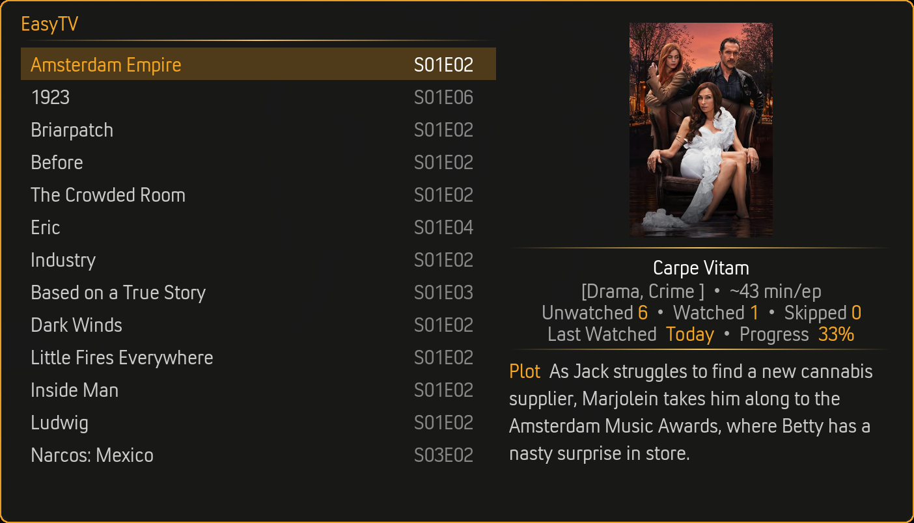

# EasyTV

**No scrolling. No deciding. Just watching.**

EasyTV transforms your Kodi library into a personal TV channel. It tracks the next episode for every TV show and lets you dive right in, or creates randomized playlists for lean-back viewing.

Built for Kodi 21+ (Omega and newer).

---

## What is EasyTV?

EasyTV maintains a list of the **next episode to watch** for every TV show in your library. Not just the first unwatched episode, but the first unwatched episode *after the last one you watched*.

### Two Ways to Watch

| Mode | Experience |
|------|------------|
| **Browse Mode** | See all your shows with their next episode. Pick what you're in the mood for. |
| **Random Playlist** | One click starts a shuffled playlist. Sit back and let EasyTV decide. |

---

## Key Features

- **Smart Episode Tracking** — Always knows your next episode, even with gaps in watch history
- **Multi-Instance Sync** — Share watch progress across multiple Kodi devices
- **Mix in Movies** — Add movies to your random playlists
- **Smart Playlist Filtering** — Use Kodi smart playlists to filter content
- **Duration Filtering** — Only shows with episodes under 30 minutes? Done.
- **Random-Order Shows** — Shuffle-friendly content like sitcoms and cartoons
- **Positioned Specials** — Include TVDB-positioned specials in the watch order
- **Partial Prioritization** — Unfinished content plays first
- **Clone Support** — Multiple EasyTV instances with different configurations

---

## Requirements

- **Kodi 21 (Omega)** or **Kodi 22 (Piers)** or later
- A TV library with watched/unwatched episodes

> ⚠️ **Not compatible** with Kodi 20 or earlier versions.

---

## Multi-Instance Sync (Optional)

If you run Kodi on multiple devices (living room, bedroom, etc.) with a **shared MySQL/MariaDB video database**, EasyTV can sync watch progress between them. When you watch Episode 5 on one device, all other devices know to queue Episode 6.

**Requirements:**
- Kodi configured with a shared MySQL/MariaDB video database
- The `pymysql` Python library (install via: `pip install pymysql`)

**Quick Setup:**
1. Install pymysql on all Kodi devices
2. Enable **"Multi-instance sync"** in EasyTV Settings → Advanced
3. That's it — EasyTV auto-detects your database from `advancedsettings.xml`

> **Note:** Some settings affect episode ordering and must match across all synced devices: **Random-order shows** and **Include positioned specials**. Mismatched settings will cause each device to calculate different "next episodes."

For detailed setup, see the [Multi-Instance Sync](https://rouzax.github.io/script.easytv/docs/multi-instance-sync/) documentation.

---

## Installation

1. Download the latest release from [Releases](https://github.com/Rouzax/script.easytv/releases)
2. In Kodi: **Settings → Add-ons → Install from zip file**
3. Select the downloaded zip file
4. Wait for the "Database analysis complete" notification
5. Launch EasyTV from **Add-ons → Program add-ons**

---

## 📖 Documentation

**Full documentation is available on the [docs site](https://rouzax.github.io/script.easytv/docs/):**

| Page | Description |
|------|-------------|
| [Installation](https://rouzax.github.io/script.easytv/docs/installation/) | Setup and first run |
| [Browse Mode](https://rouzax.github.io/script.easytv/docs/browse-mode/) | Episode list guide |
| [Random Playlist Mode](https://rouzax.github.io/script.easytv/docs/random-playlist-mode/) | Shuffled playlists |
| [Settings Reference](https://rouzax.github.io/script.easytv/docs/settings-reference/) | All settings explained |
| [Smart Playlist Integration](https://rouzax.github.io/script.easytv/docs/smart-playlist-integration/) | Advanced filtering |
| [Smart Playlist Examples](https://rouzax.github.io/script.easytv/docs/smart-playlist-examples/) | Ready-to-use playlist files |
| [Random-Order Shows](https://rouzax.github.io/script.easytv/docs/random-order-shows/) | Shuffle-friendly content |
| [Multi-Instance Sync](https://rouzax.github.io/script.easytv/docs/multi-instance-sync/) | Share progress across devices |
| [Advanced Features](https://rouzax.github.io/script.easytv/docs/advanced-features/) | Clones, exporter, more |
| [Troubleshooting & FAQ](https://rouzax.github.io/script.easytv/docs/troubleshooting-and-faq/) | Common issues |

---

## Quick Links

- **[Report a Bug](https://github.com/Rouzax/script.easytv/issues/new)**
- **[Kodi Forum Thread](https://forum.kodi.tv/showthread.php?tid=383902)**
- **[Changelog](changelog.txt)**

---

## Credits & License

EasyTV began in 2024 as a fork of [LazyTV](https://github.com/KODeKarnage/script.lazytv) by KODeKarnage (2013). It has since been completely rewritten.

This project is licensed under the **GNU General Public License v3.0** (GPL-3.0-only).

See [LICENSE.txt](LICENSE.txt) for the full license text.

---

*EasyTV — Because your library should work for you, not the other way around.*
