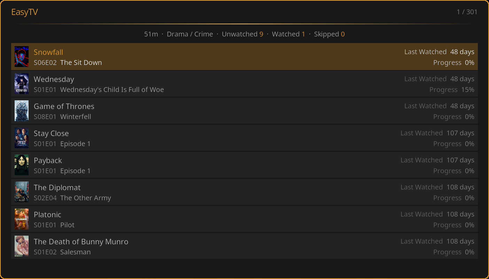
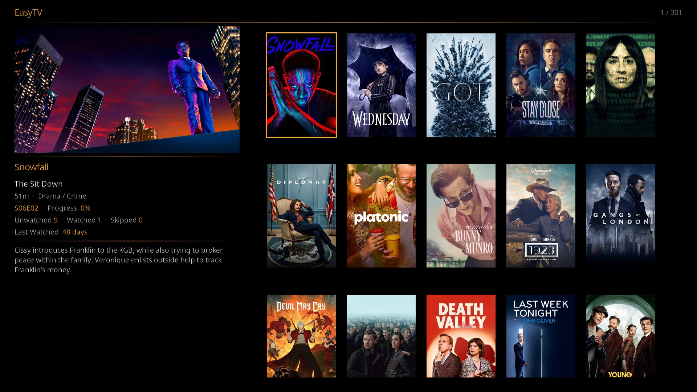
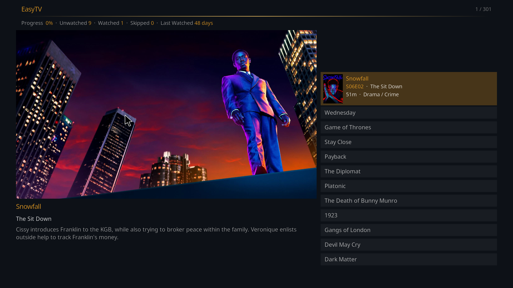
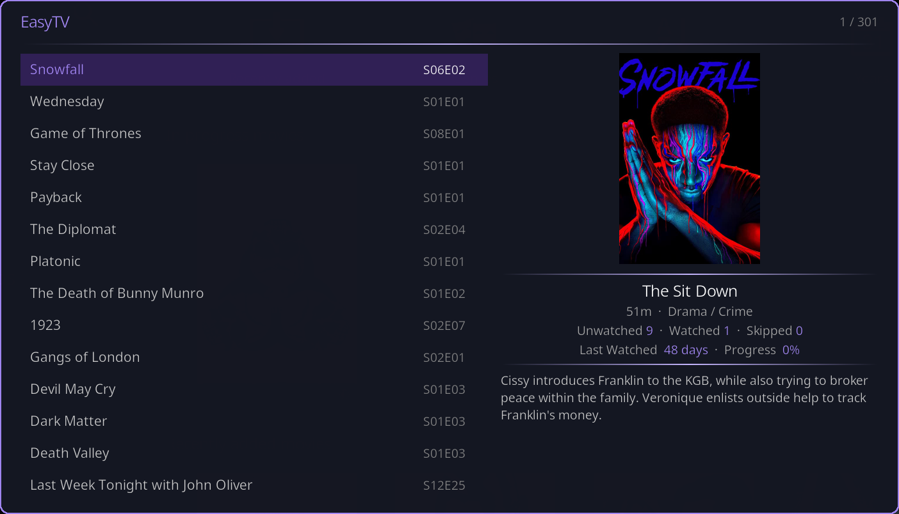
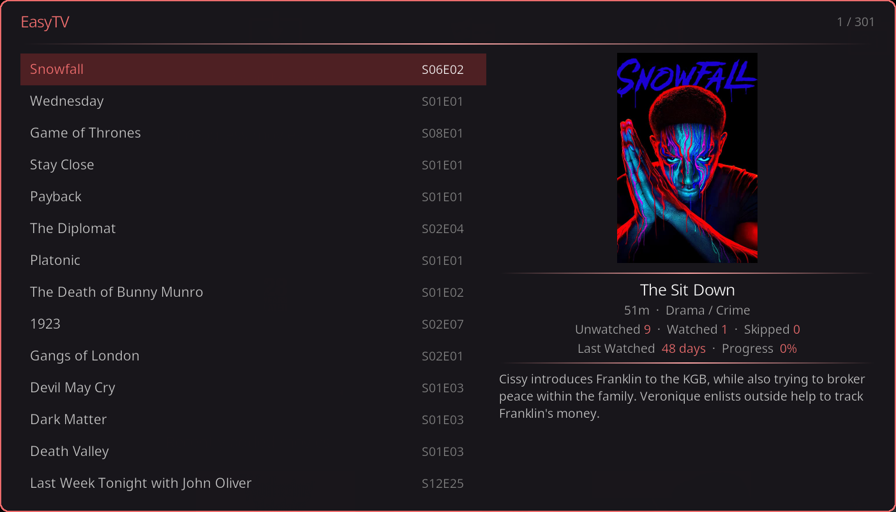
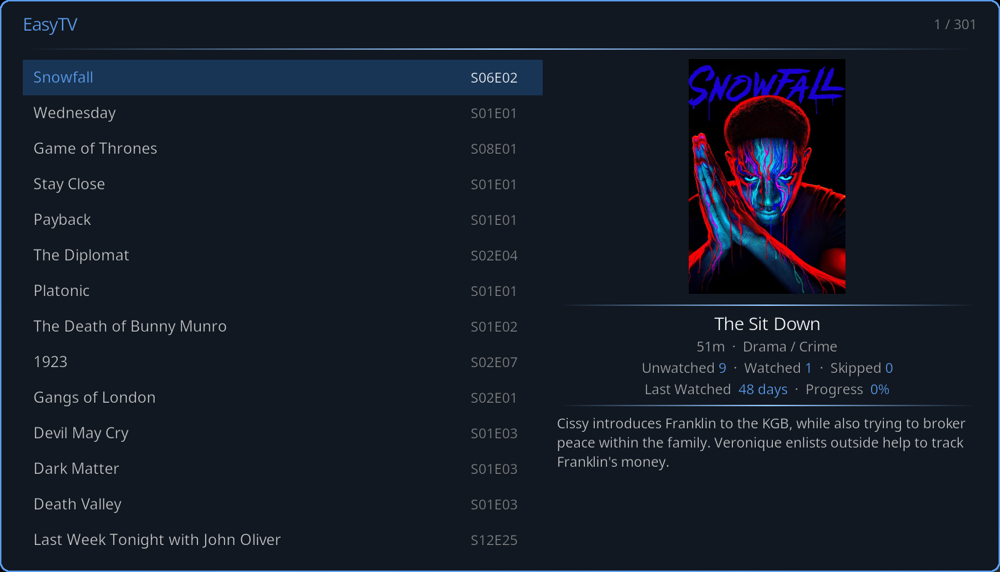

# Browse Mode

Browse Mode displays all your TV shows with their next episode ready to play. You're in control: scan the list, pick what you're in the mood for, and start watching.

---

## How It Works

1. **EasyTV scans your library:** The background service identifies the next episode for every show
2. **Opens the episode list:** Shows appear sorted by your preference (default: last watched)
3. **Select a show:** Click to immediately start playing that episode
4. **List updates:** After watching, the list refreshes with your new next episode

---

## View Styles

EasyTV offers five visual layouts. Change via **Settings > Browse Mode > Appearance > View style**.

### Card List (Default)

The default view with data-dense rows. Each row shows the show's poster, name, episode title, season/episode number, last watched date, and progress percentage.

Best for: Quick navigation with detailed information at a glance.

### Posters

A visual grid showing show poster artwork. The focused show displays episode details and plot summary in the bottom-left corner.

Best for: Visual browsing, recognizing shows by artwork.

### Big Screen

Large poster artwork on the left with episode details and a scrollable show list on the right. Optimized for 10-foot viewing from a distance.

Best for: Living room viewing from a couch, remote control navigation.

### Split View

Two-column layout: a compact show list on the left and a detail panel on the right showing the focused show's poster, season/episode info, stats (progress, unwatched, watched, skipped), and plot summary.

Best for: Balanced browsing with details always visible.

### Showcase

A horizontal poster filmstrip with a fixed focus position. The focused poster zooms in (420 x 630) with a smooth animation, and an info panel below shows the show title, next episode, metadata, stats, and plot.

Best for: Cinematic, gallery-style browsing where the focused poster is the centerpiece.

---

## Themes

All views and dialogs use your selected accent color theme. Change via **Settings > EasyTV > Appearance > Theme**.

| Theme | Accent Color |
|-------|-------------|
| **Golden Hour** (default) | Warm orange/golden |
| **Ultraviolet** | Purple |
| **Ember** | Red |
| **Nightfall** | Blue |

| | |
|---|---|
|  |  |
|  |  |

---

## Sorting Options

Control how shows are ordered. Change via **Settings > Browse Mode > Sorting**.

| Sort Method | Description | Use Case |
|-------------|-------------|----------|
| **Show Name** | Alphabetical order | Finding a specific show |
| **Last Watched** (default) | Most recently watched shows first | Continue what you were watching |
| **# Unwatched Episodes** | Shows with most unwatched episodes first | Binge-worthy shows |
| **# Watched Episodes** | Shows you've watched most first | Your favorites |
| **Season** | Grouped by which season you're on | See progress across shows |
| **Random** | Shuffled order | Surprise yourself with what shows up first |
| **Avg Episode Duration** | Shows ordered by typical episode length | Pick something that fits your time slot |

### Reverse Sort Order

Enable **Reverse sort order** to flip the direction:
- Last Watched: Oldest first instead of newest
- Show Name: Z-A instead of A-Z
- Episode counts: Fewest first instead of most
- Avg Episode Duration: Shortest first instead of longest

(Random has no meaningful reverse.)

### Article Handling

EasyTV intelligently handles leading articles when sorting by name:
- "The Office" sorts under "O" (not "T")
- "A Series of Unfortunate Events" sorts under "S"
- Supports articles in multiple languages (English, Spanish, German, French, etc.)

---

## Context Menu

Press `C` on keyboard or the menu button on your remote to open the context menu.

### Available Actions

| Action | Description |
|--------|-------------|
| **Multi-Select (on/off)** | Toggle selection mode for batch operations |
| **Play Episode** / **Play Selection** | Plays the focused episode (single mode) or every selected episode (multi-select mode) |
| **Play From Here** | Play current episode and all below it |
| **Export Episode** / **Export Selection** | Copies the focused episode (single mode) or every selected episode (multi-select mode) to a folder |
| **Mark as Watched** | Mark selected episodes as watched |
| **Update Library** | Trigger a Kodi library scan |
| **Refresh List** | Reload the episode list from the service |

The Play and Export labels switch between "Episode" and "Selection" automatically depending on whether multi-select is on.

---

## Multi-Select Mode

Multi-select lets you work with multiple episodes at once.

### Enabling Multi-Select

1. Open the context menu (`C` or menu button)
2. Select **Multi-Select (on)**
3. The mode indicator changes

### Using Multi-Select

- **Click an episode:** Toggles its selection (highlighted)
- **Click again:** Deselects it
- **Navigate:** Move through the list without changing selection

### Actions in Multi-Select

With episodes selected:

| Action | Result |
|--------|--------|
| **Play Selection** | Plays all selected episodes as a playlist |
| **Export Selection** | Copies all selected episode files |
| **Mark as Watched** | Marks all selected as watched |

### Exiting Multi-Select

1. Open context menu
2. Select **Multi-Select (off)**
3. All selections are cleared

---

## Play From Here

A quick way to play everything from your current position to the end of the list.

**How it works:**
1. Navigate to a show in the list
2. Open context menu > **Play From Here**
3. EasyTV creates a playlist starting with that episode
4. All episodes below it in the list are added

**Use case:** You've sorted by "Last Watched" and want to catch up on several shows in order.

---

## Return After Playback

By default, EasyTV returns to the episode list after you finish watching. This lets you quickly pick your next show.

**To disable:** Settings > Browse Mode > Appearance > **Return to EasyTV after playback** > Off

When disabled, playback ends at your previous Kodi location (home screen, etc.).

---

## Filtering Shows

Control which shows appear in Browse Mode.

### Using the Show Filter

1. Go to **Settings > Shows > Show Filter**
2. Enable **Use only selected shows**
3. Choose your **Selection method**:

| Method | Description |
|--------|-------------|
| **Pick shows manually** | Opens a dialog to select specific shows |
| **Use a smart playlist** | Filters based on a Kodi smart playlist |

### Manual Selection

1. Select **Pick shows manually**
2. Click **Select shows...**
3. Check/uncheck shows to include
4. Click **Save**

### Smart Playlist Selection

1. Select **Use a smart playlist**
2. Choose **Ask each time** or **Use default**
3. If using default, click **Choose playlist file...** to select a `.xsp` file

See [Smart Playlist Integration](smart-playlist-integration.md) for creating filter playlists.

---

## Episode Options

**Settings → Shows → Show Filter → Series premieres / Season premieres**

Control which premiere episodes appear in the browse list. Each setting has three modes:

| Mode | Series premieres (S01E01) | Season premieres (SxxE01) |
|------|--------------------------|--------------------------|
| **Skip** | Hides unstarted shows | Hides new-season episodes |
| **Mix in** | Shows appear alongside regular episodes (default) | Season premieres appear alongside regular episodes (default) |
| **Only** | Restricts list to premieres only | Restricts list to premieres only |

When either setting is **Only**, the entire browse list shows only premiere episodes. The other setting then controls which premiere types appear:

| Series premieres | Season premieres | What you see |
|-----------------|-----------------|-------------|
| Only | Mix in | All premieres (S01E01 + season premieres) |
| Only | Skip | S01E01 only, to discover completely new shows |
| Mix in | Only | All premieres (S01E01 + season premieres) |
| Skip | Only | Season premieres only, to find new seasons of shows you've started |

> **Example:** You finished Season 1 of Breaking Bad. With season premieres set to **Mix in**, S02E01 appears in your list. Set to **Skip**, Breaking Bad disappears until you manually watch S02E01. Set to **Only**, your list shows only premiere episodes, which is a quick way to see what's new.

---

## Episode Duration Filter

Filter shows by typical episode length.

1. Go to **Settings > Shows > Episode Duration**
2. Enable **Enable duration filter**
3. Set **Minimum episode length** (0 = no minimum)
4. Set **Maximum episode length** (0 = no maximum)

**Examples:**
- Quick viewing session: Max 30 minutes
- Feature-length episodes: Min 40 minutes
- Standard sitcoms: Min 20, Max 30 minutes

> **Note:** Duration is calculated as the median across all episodes in a show. Shows without duration metadata are excluded when the filter is active.

---

## Hiding Random-Order Shows

If you've configured [Random-Order Shows](random-order-shows.md), you can hide them from Browse Mode.

**Settings > Browse Mode > Appearance > Hide random-order shows**

When enabled:
- Random-order shows don't appear in the episode list
- They still appear in random playlists
- Useful if you only want to watch these shows via shuffle

---

## Performance Options

For large libraries or low-power devices:

### Limit Shows Displayed

1. Go to **Settings > Browse Mode > Performance**
2. Enable **Limit shows displayed**
3. Set **Maximum shows** (1-30)

This caps how many shows load in the list, improving responsiveness.

### Other Tips

- Use **Card List** view style (lighter than Posters)
- Sort by **Last Watched** (faster than episode count sorts)
- Keep your library well-maintained (remove duplicates, fix metadata)

---

## Keyboard Shortcuts

| Key | Action |
|-----|--------|
| **Enter** | Play selected episode |
| **C** | Open context menu |
| **Backspace** / **Esc** | Close EasyTV |
| **Arrow keys** | Navigate list |

---

## Related Pages

- **[Random Playlist Mode](random-playlist-mode.md):** The other way to watch
- **[Settings Reference](settings-reference.md):** All Browse Mode settings
- **[Smart Playlist Integration](smart-playlist-integration.md):** Advanced filtering
- **[Random-Order Shows](random-order-shows.md):** Shuffle-friendly configuration
