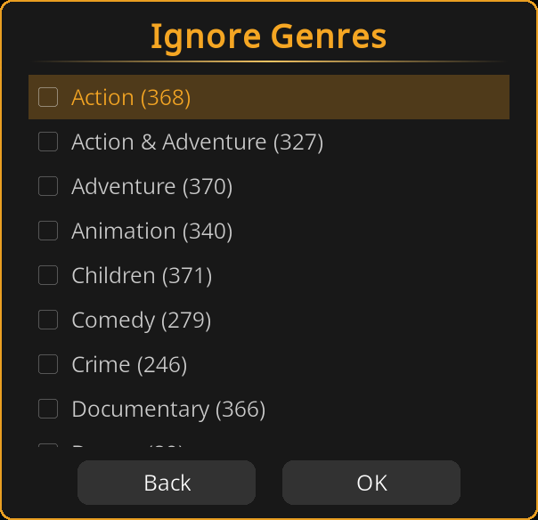
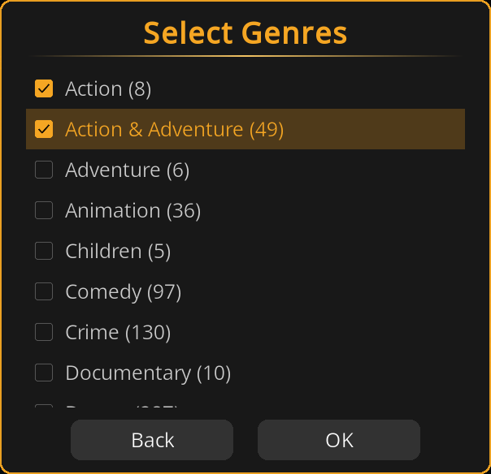
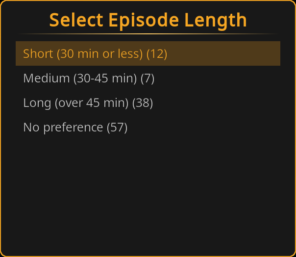
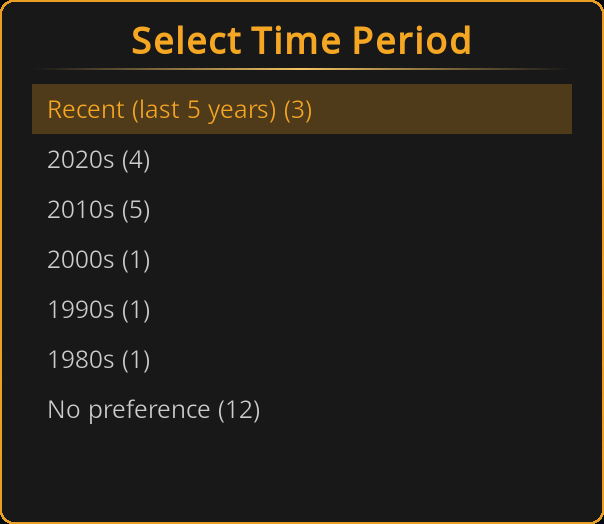
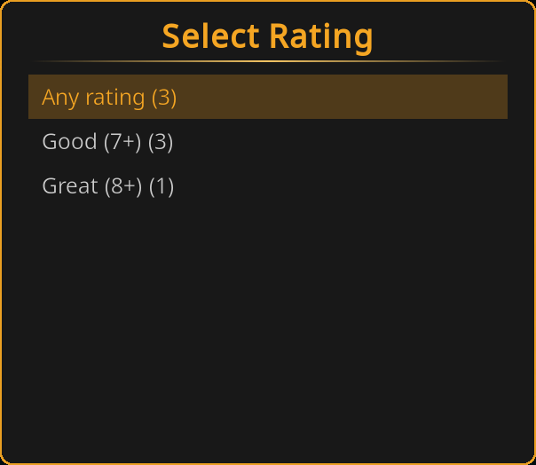
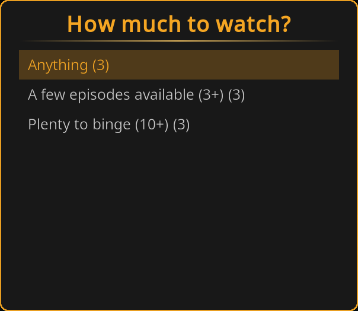
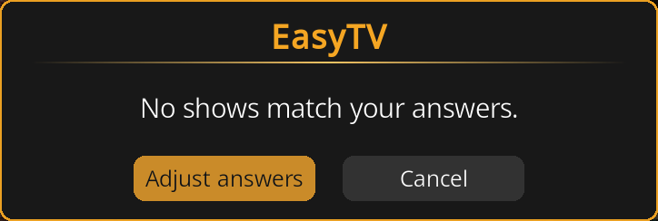

# Guided Questions

> **Configured under** **Settings → EasyTV → Guided questions**

Before Browse Mode or Random Playlist Mode opens, EasyTV can narrow the shows on offer to match what you're in the mood for right now. Each of the six questions has its own **mode** (Ask, Pre-set, or Skip), so you decide, per question, whether it interrupts your launch with a dialog, applies a fixed answer silently, or does nothing at all.

---

## Why Use It?

EasyTV's usual filters (show selection, smart playlists, episode selection, premieres) are fixed until you change them in settings. Guided questions add a layer on top: a narrowing of today's candidates that never touches your saved configuration.

- Set a question's mode to **Ask** and it interrupts your launch with a dialog, the way all six questions worked before modes existed.
- Set it to **Pre-set** and it applies a fixed answer every launch with no dialog at all.
- Set it to **Skip** and it does nothing.

Mix and match per question: ask about genre every time, silently pre-set a minimum rating, and skip the era question entirely. Answers from **Ask** questions apply to that one launch only and are never saved to settings.

---

## Prerequisites

- **Settings → EasyTV → Guided questions → Ask what I'm in the mood for on launch** must be On (default: Off). This is the master switch; with it off, no question runs regardless of its mode.
- The questions run before Browse Mode or before building a Random Playlist. They do not run for a **Playlist content** of "Movies only", since there are no TV shows to narrow (see [Works With Clones](#works-with-clones-and-movies-only-playlists) below).

---

## Enabling It

1. Open **Add-ons → EasyTV → Configure**
2. Go to **EasyTV → Guided questions**
3. Turn on **Ask what I'm in the mood for on launch**
4. For each question, choose its mode: leave it on **Ask** to keep being asked, switch it to **Pre-set** and configure a fixed answer, or switch it to **Skip** to drop it
5. Optionally turn on **Remember my answers** or turn off **Show result counts**

The next time you launch EasyTV (to Browse Mode, Random Playlist, or after choosing one from the "Ask me" launch prompt), any question still set to **Ask** appears; **Pre-set** and **Skip** questions apply (or don't) without a dialog.

---

## Modes

Every question has its own mode setting, defaulting to **Ask**:

| Setting | Question it controls | Default |
|---------|----------------------|---------|
| **Genres to avoid** | Ignore Genres | Ask |
| **Genres** | Select Genres | Ask |
| **Episode length** | Select Episode Length | Ask |
| **Era** | Select Time Period | Ask |
| **Rating** | Select Rating | Ask |
| **How much to watch** | How much to watch? | Ask |

Each spinner offers three options:

| Option | What happens |
|--------|--------------|
| **Ask** | The question's dialog appears at launch, exactly as before EasyTV had modes. |
| **Pre-set** | No dialog. The question's configured preset (see [Presets](#presets)) applies silently every launch. |
| **Skip** | No dialog, and nothing applies for this question. The episode-length question is the one exception: Skip still falls back to the **Duration Filter** setting (Shows category) when that filter is enabled; see [Episode Length and the Duration Filter](#episode-length-and-the-duration-filter). |

Since every mode defaults to **Ask**, a freshly installed or upgraded EasyTV that has **Ask what I'm in the mood for on launch** turned on behaves exactly as it did before modes existed: all six questions asked every launch.

---

## The Questions

Up to six questions can appear, in this order. Each one is controlled by its own mode setting.

| # | Question (dialog heading) | Mode setting | Preset setting(s) |
|---|----------------------------|---------------|---------------------|
| 1 | Ignore Genres | Genres to avoid | Choose genres to avoid... |
| 2 | Select Genres | Genres | Choose genres... |
| 3 | Select Episode Length | Episode length | Pre-set episode length |
| 4 | Select Time Period | Era | Only shows from the last (years) |
| 5 | Select Rating | Rating | Pre-set rating |
| 6 | How much to watch? | How much to watch | Pre-set how much to watch |

When a question is asked (mode **Ask**), every answer narrows the candidate list for the questions that follow it, so later questions and their result counts (see [Result Counts](#result-counts)) reflect everything you've picked so far. Questions set to **Pre-set** or **Skip** don't appear in the dialog sequence at all; the questions still set to **Ask** run back to back with no gaps.

### 1. Ignore Genres

A multi-select list of every genre present in your candidate shows. Pick any number of genres to exclude, or pick none. Genres you avoid here are removed from the list offered by question 2 during the same run.

### 2. Select Genres

A multi-select list of the remaining genres. Pick any number to require at least one of; pick none to leave genre unrestricted.

If none of your candidate shows have genre metadata, a genre question set to **Ask** is skipped automatically for that launch.

### 3. Select Episode Length

A single-select choice: **Short (30 min or less)**, **Medium (30-45 min)**, **Long (over 45 min)**, or **No preference**.

An answer here **replaces** your **Duration Filter** setting for this run; see [Episode Length and the Duration Filter](#episode-length-and-the-duration-filter). **No preference** falls back to your existing Duration Filter setting instead.

### 4. Select Time Period

A single-select choice built from the years present in your candidate shows: **Recent (last 5 years)**, one option per decade that has shows (newest first, e.g. "2020s", "2010s"), and **No preference**.

### 5. Select Rating

A single-select choice: **Any rating**, **Good (7+)**, **Great (8+)**.

### 6. How much to watch?

A single-select choice about how many matching episodes a show should have available: **Anything**, **A few episodes available (3+)**, **Plenty to binge (10+)**.

What counts as an "eligible" episode depends on your **Episode selection** setting (Random Playlist → Content Options), or is fixed to unwatched episodes in Browse Mode:

| Episode selection | What "eligible episodes" counts |
|--------------------|----------------------------------|
| **Unwatched only** (and always in Browse Mode) | Remaining unwatched episodes |
| **Watched only** | Episodes already in your watch history |
| **Both** | Total episode count |

---

## Presets

A question set to **Pre-set** applies a configured value silently. Each question has its own preset setting, visible once that question's mode is set to **Pre-set**:

| Question | Preset setting | Options | Default |
|----------|-----------------|---------|---------|
| Ignore Genres | **Choose genres to avoid...** | Opens the genre picker | (none selected) |
| Select Genres | **Choose genres...** | Opens the genre picker | (none selected) |
| Select Episode Length | **Pre-set episode length** | No preference / Short (30 min or less) / Medium (30-45 min) / Long (over 45 min) | No preference |
| Select Time Period | **Only shows from the last (years)** | 0-30 (slider) | 0 (disabled) |
| Select Rating | **Pre-set rating** | Any rating / Good (7+) / Great (8+) | Any rating |
| How much to watch? | **Pre-set how much to watch** | Anything / A few episodes available (3+) / Plenty to binge (10+) | Anything |

### The genre picker

**Choose genres to avoid...** and **Choose genres...** are action buttons. Each opens the same themed multi-select dialog used by the Ignore Genres / Select Genres questions, listing every genre in your library. Your selection is stored as a preset (not written to the ignore/genre question's remembered answer), and a read-only **Selected:** row underneath the button shows what you picked, or "-" when nothing is selected.

### Preset values that mean "no filter"

A preset can itself mean "apply no filter," and behaves the same as if that question were set to **Skip**:

- **Choose genres to avoid...** / **Choose genres...** with nothing selected
- **Pre-set episode length** left at **No preference**
- **Only shows from the last (years)** left at **0**
- **Pre-set rating** left at **Any rating**
- **Pre-set how much to watch** left at **Anything**

---

## Precedence: Presets vs. Remembered Answers

These only matter for a question set to **Ask**, since **Pre-set** and **Skip** never show a dialog.

When an **Ask** question's dialog appears, it needs a starting selection:

1. If **Remember my answers** is on and you have a saved answer for that question from a previous run, the remembered answer is pre-selected.
2. Otherwise, if that question has a preset configured (regardless of the question's own mode; a question can be **Ask** while still carrying a preset value from when it was **Pre-set**), the preset is pre-selected.
3. Otherwise nothing is pre-selected.

A pre-selected answer is only a starting point: you can still pick something else before continuing. Presets never apply automatically to an **Ask** question; only the mode being **Pre-set** does that.

---

## Episode Length and the Duration Filter

The episode-length question interacts with the **Duration Filter** setting (Shows category → Episode Duration → **Enable duration filter**) depending on its mode:

| Mode | Result |
|------|--------|
| **Ask**, answered with a length | That length replaces the Duration Filter for this launch. |
| **Ask**, answered with **No preference** | Falls back to the Duration Filter setting, if enabled. |
| **Pre-set**, with a length bucket configured | That length replaces the Duration Filter for this launch, same as answering it directly. |
| **Pre-set**, left at **No preference** | Falls back to the Duration Filter setting, if enabled. |
| **Skip** | Falls back to the Duration Filter setting, if enabled. |

In every "falls back" case, if the Duration Filter is also off, no episode-length filtering happens at all for this launch.

---

## How It Interacts With Your Settings

Guided questions narrow the candidates your existing settings already produce. They do not replace those settings:

- **Show filter, smart playlist, episode selection, premiere settings** all still apply first. The questions only ever narrow that set further, never widen it.
- **Duration Filter** is the one exception: see [Episode Length and the Duration Filter](#episode-length-and-the-duration-filter) above.
- Nothing an **Ask** question produces is written to settings. Close EasyTV and reopen it (with **Remember my answers** off) and your saved settings are exactly as you left them. Presets, by contrast, live in settings, since they're configuration rather than a one-off answer.

---

## Remembered Answers

Turn on **Remember my answers** (Settings → EasyTV → Guided questions) and your choices from the last completed run of each **Ask** question are pre-selected the next time that question's dialog appears, so repeating a mood is a few taps instead of a full run-through. They're not applied automatically; you still walk through each question still set to **Ask**.

Remembered answers are stored per EasyTV instance in `wizard_answers.json` under that instance's `addon_data` folder (`special://profile/addon_data/<addon id>/wizard_answers.json`), not in settings. Turning the toggle off stops pre-selecting saved answers; it does not delete the file. A remembered answer for a question later switched away from **Ask** is simply not used until that question is set back to **Ask**.

---

## Result Counts

Turn on **Show result counts** (Settings → EasyTV → Guided questions) and every answer option in an **Ask** question's dialog shows how many shows would remain if you picked it, e.g. "Comedy (12)". Counts reflect the answers you've already given to earlier questions in this run. Turn the toggle off for a plainer list with no counts. **Pre-set** and **Skip** questions never show a dialog, so this setting has no effect on them.

---

## Works With Clones and Movies-Only Playlists

Every [clone](clones.md) has its own independent copy of the Guided Questions settings: its own master switch, its own mode for every question, its own presets, and its own remembered answers, exactly like its other settings.

A saved mood is now literally presets plus zero asked questions: turn on a clone's master switch, set every question's mode to **Pre-set** or **Skip**, and configure the presets you want. That clone always launches straight to Browse Mode or Random Playlist with candidates already narrowed, with no dialog at all: give it a name like "Bedtime" or "Comedy Night" and add it to your home screen. Leave one or two questions on **Ask** instead if you want the clone to still ask about those.

Turning off a clone's master switch (the default) leaves that clone launching straight to Browse Mode or Random Playlist, unaffected by the main instance's setting.

When **Playlist content** (Random Playlist settings) is set to **Movies only**, the questions are skipped entirely (regardless of mode): they only narrow TV shows, and a movies-only playlist has none to narrow. This applies the same way on a clone as on the main instance.

---

## When No Shows Match

If the combination of asked answers and presets leaves zero shows, and at least one question is set to **Ask**, EasyTV shows "No shows match your answers." with two choices:

- **Adjust answers**: returns you to the first **Ask** question with everything you already picked still selected, so you can loosen one or two answers rather than starting over. Presets and **Skip** questions are unaffected, since they never asked anything to adjust.
- **Cancel**: closes the questions and cancels the launch.

If every question is set to **Pre-set** or **Skip**, nothing was asked, so there is no dialog to show and no answers to adjust. EasyTV launches straight into Browse Mode or Random Playlist with zero candidates, and that mode shows its own normal empty-result screen instead. If this happens, review your **Pre-set** values above; a preset combination can leave zero shows just as an answered question can, but silently, with no dialog pointing at it.

---

## Related Pages

- **[Browse Mode](browse-mode.md):** One of the two modes guided questions can narrow
- **[Random Playlist Mode](random-playlist-mode.md):** The other mode guided questions can narrow
- **[Settings Reference](settings-reference.md):** All Guided Questions settings
- **[Clones](clones.md):** How to build a saved mood as its own clone
- **[Troubleshooting & FAQ](troubleshooting-and-faq.md):** "The questions found no shows"
