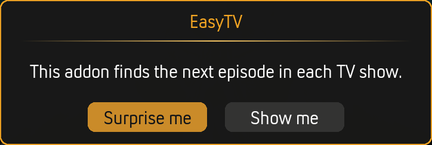

# Installation

## Requirements

| Requirement | Details |
|-------------|---------|
| **Kodi Version** | Kodi 21 (Omega) or Kodi 22 (Piers) or later |
| **Library** | A TV library with watched/unwatched episode tracking |
| **Optional** | Movies library (for mixed playlists) |
| **Optional** | Shared MySQL/MariaDB database + `script.module.pymysql` (for [multi-instance sync](multi-instance-sync.md)) |

> ⚠️ **Not compatible** with Kodi 20 (Nexus) or earlier versions. EasyTV uses Python 3.8+ features and Kodi 21+ APIs.

---

## Installation Methods

### From GitHub (Recommended)

1. **Download the latest release**
   - Go to [Releases](https://github.com/Rouzax/script.easytv/releases)
   - Download the `.zip` file (e.g., `script.easytv-1.2.0.zip`)
   - **Do not extract the zip** — Kodi needs the zip file directly

2. **Install in Kodi**
   - Open Kodi
   - Go to **Settings → Add-ons → Install from zip file**
   - Navigate to your Downloads folder
   - Select the `script.easytv-x.x.x.zip` file

3. **Enable Unknown Sources (if prompted)**
   - Kodi may ask you to enable "Unknown sources"
   - Go to **Settings → System → Add-ons**
   - Enable **Unknown sources**
   - Return and retry the installation

4. **Confirmation**
   - You'll see a notification: "EasyTV Add-on installed"
   - The background service starts automatically

### From Kodi Repository

*(Coming soon — EasyTV will be submitted to the official Kodi addon repository)*

---

## First Run

### What Happens Automatically

When EasyTV installs, its background service starts and:

1. **Scans your TV library** — Identifies all shows with unwatched episodes
2. **Calculates episode durations** — Samples episodes to determine typical length per show
3. **Caches the data** — Stores results for fast subsequent startups
4. **Shows a notification** — "Database analysis complete" when ready

### Startup Times

| Scenario | Typical Time | Notes |
|----------|--------------|-------|
| **First run** | 2-30 seconds | Depends on library size and hardware |
| **Subsequent runs** | Under 1 second | Duration data is cached to disk |

*Large libraries on network storage or low-power devices (Raspberry Pi) take longer on first run.*

### Launching EasyTV

Once the "Database analysis complete" notification appears:

When you first launch EasyTV, you'll see the main dialog:

1. **From Add-ons menu**
   - Go to **Add-ons → Program add-ons → EasyTV**

2. **From home screen** (recommended)
   - Most skins let you add shortcuts to your home menu
   - Add EasyTV to your "Programs" or create a custom menu item

3. **Via keyboard/remote shortcut**
   - You can map EasyTV to a button using Kodi's keymap editor

---

## Initial Configuration

EasyTV works out of the box with sensible defaults, but you may want to customize:

### Essential Settings to Consider

| Setting | Location | Why Configure? |
|---------|----------|----------------|
| **When I open EasyTV** | Settings → EasyTV | Choose your preferred mode: Browse, Random, or Ask |
| **Include series premieres** | Settings → Shows | Disable if you don't want shows you haven't started |
| **Playlist content** | Settings → Random Playlist | Add movies to your random playlists |

### Accessing Settings

**Method 1: From Kodi**
- Navigate to **Add-ons → Program add-ons**
- Highlight EasyTV (don't click)
- Press `C` on keyboard or `Menu` on remote
- Select **Configure**

**Method 2: From EasyTV**
- Open EasyTV
- Open the context menu (`C` or long-press)
- Select settings-related options

---

## Verifying Installation

### Check the Background Service

The background service must be running for EasyTV to work:

1. Go to **Settings → Add-ons → My add-ons → Services**
2. Find **EasyTV** in the list
3. Ensure it shows as **Enabled**

If it's disabled, click to enable it and restart Kodi.

### Check Window Properties (Advanced)

For debugging, you can verify EasyTV is tracking shows:

1. Enable **Settings → Advanced → Debugging → Enable debug logging**
2. Open the log file at `special://profile/addon_data/script.easytv/logs/easytv.log`
3. Look for entries showing shows being processed

---

## Multi-Device Setup

If you run Kodi on multiple devices with a shared MySQL/MariaDB video database, EasyTV can sync watch progress across all of them. See [Multi-Instance Sync](multi-instance-sync.md) for setup instructions.

---

## Updating EasyTV

> **Tip:** When upgrading across major feature releases, check the [Migration Guide](migration-guide.md) for any breaking changes or required actions.

### Manual Update

1. Download the new version from [Releases](https://github.com/Rouzax/script.easytv/releases)
2. Install via **Settings → Add-ons → Install from zip file**
3. Kodi will update the existing installation

### Clone Updates

If you've created [clones](advanced-features.md#clone-feature), they update automatically:

1. Launch the clone after updating the main EasyTV addon
2. EasyTV detects the version mismatch
3. A prompt asks "Would you like to update the clone now?"
4. Click **Yes** and restart Kodi

---

## Uninstallation

1. Go to **Settings → Add-ons → My add-ons → Program add-ons**
2. Select **EasyTV**
3. Click **Uninstall**

This removes:
- The addon files
- The background service

This preserves:
- Your addon data (settings, logs) in `special://profile/addon_data/script.easytv/`

To fully remove all data, manually delete the `script.easytv` folder from your addon_data directory.

---

## Next Steps

- **[Browse Mode](browse-mode.md)** — Learn to navigate the episode list
- **[Random Playlist Mode](random-playlist-mode.md)** — Set up lean-back viewing
- **[Settings Reference](settings-reference.md)** — Explore all configuration options
