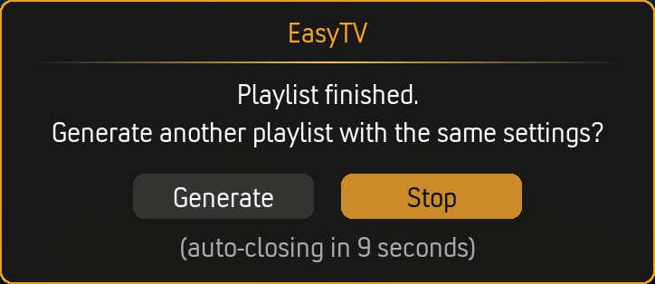

# Random Playlist Mode

Random Playlist Mode creates a shuffled playlist of episodes (and optionally movies) from your library. One click and playback starts immediately. Perfect for eliminating decision fatigue.

``` title="Random Playlist"
Now Playing: The Office S04E01 - Fun Run

Up Next:
  1. Breaking Bad S02E03
  2. Fargo (2014 film)
  3. Better Call Saul S01E01
  4. Parks and Recreation S03E12
  5. The Sopranos S03E08
```

---

## How It Works

1. **EasyTV gathers candidates:** Your shows (and optionally movies) based on settings
2. **Builds a shuffled playlist:** Randomizes the order
3. **Prioritizes partials:** Unfinished content moves to the front
4. **Starts playback:** First item plays immediately
5. **Continues automatically:** Playlist plays through without interaction

---

## Playlist Content

Choose what goes in your playlist. **Settings → Random Playlist → Basics → Playlist content**

| Option | Content |
|--------|---------|
| **TV episodes only** | Only TV show episodes |
| **TV and movies** | Mix of episodes and movies |
| **Movies only** | Only movies, no TV |

---

## Playlist Length

**Settings → Random Playlist → Basics → Playlist length**

Set how many items (episodes + movies) appear in the playlist. Range: 1-50.

> **Tip:** Shorter playlists (5-10) work well for casual viewing. Longer playlists (20+) are great for background watching.

---

## Episode Selection

Control which TV episodes are included. **Settings → Random Playlist → Content Options → Episode selection**

| Option | Episodes Included | Behavior |
|--------|-------------------|----------|
| **Unwatched only** | Only unwatched episodes | Plays your "next" episode for each show |
| **Watched only** | Only watched episodes | Random rewatches from your history |
| **Both** | Unwatched and watched | Mix of new and rewatches |

### Unwatched Episode Chance

When using **Both**, this slider controls the mix. **Settings → Random Playlist → Content Options → Unwatched episode chance**

| Value | Result |
|-------|--------|
| **100%** | Always pick unwatched (same as "Unwatched only") |
| **80%** | Mostly new episodes, occasional rewatches |
| **50%** | Equal chance of new or rewatch |
| **20%** | Mostly rewatches, occasional new episode |
| **0%** | Always pick watched (same as "Watched only") |

> **Note:** Unwatched episodes always play in order (your next on-deck episode). Watched episodes are picked randomly from your watch history.

---

## Movie Options

When **Playlist content** includes movies:

### Movie Selection

**Settings → Random Playlist → Content Options → Movie selection**

| Option | Movies Included |
|--------|-----------------|
| **Unwatched only** | Movies you haven't seen |
| **Watched only** | Movies you've already watched |
| **Both** | Mix of new and rewatches |

### Movie Chance

**Settings → Random Playlist → Content Options → Movie chance**

Controls the percentage of the playlist devoted to movies (only for "TV and movies" mode).

| Value | Result (20-item playlist) |
|-------|--------------------------|
| **0%** | No movies (TV only) |
| **10%** | ~2 movies |
| **25%** | ~5 movies (default) |
| **50%** | ~10 movies (equal mix) |
| **75%** | ~15 movies |
| **100%** | All movies |

### Start Watched Movies at Random Point

**Settings → Random Playlist → Content Options → Start watched movies at random point**

When enabled, watched movies start playing at a random point (5-75% through), like catching a movie already in progress on TV.

> Only available when **Movie selection** includes watched movies.

### Filter Movies by Playlist

**Settings → Random Playlist → Content Options → Filter movies by playlist...**

Use a Kodi smart playlist to limit which movies are included. Click to select a `.xsp` file.

**Examples:**
- Only comedies
- Only movies from the 90s
- Only highly-rated films

See [Smart Playlist Examples](smart-playlist-examples.md) for ready-to-use filters.

---

## Partial Content Prioritization

EasyTV can move unfinished content to the front of your playlist, so you finish what you started.

### TV Episodes

**Settings → Random Playlist → Content Options → Start playlist with unfinished episodes**

When enabled:
- Episodes you've partially watched are identified
- They're moved to the beginning of the playlist
- Sorted by recency (most recently watched first)

### Movies

**Settings → Random Playlist → Content Options → Start playlist with unfinished movies**

Same behavior for partially watched movies.

### How Prioritization Works

1. **All partials are gathered:** Every partially watched item matching your selection filters
2. **Sorted by recency:** Most recently watched items first
3. **Same-show order preserved:** If you have two partial episodes from the same show, they stay in episode order
4. **Moved to front:** Partials become the first items in the playlist
5. **Random content follows:** Shuffled content fills the rest

**Example:** You have:
- Breaking Bad S02E05 (partial, watched yesterday)
- Inception (partial, watched 3 days ago)
- The Office S04E01 (partial, watched last week)

With both partial settings enabled, your playlist starts:
```
1. Breaking Bad S02E05     ← Most recent partial
2. Inception               ← Second most recent
3. The Office S04E01       ← Oldest partial
4. [random content...]     ← Shuffled remaining items
```

---

## Resume Point Seeking

Control whether EasyTV automatically skips to where you left off.

### For TV Episodes

**Settings → Random Playlist → Content Options → Seek to resume point for episodes**

| Setting | Behavior |
|---------|----------|
| **On** | Partial episodes resume where you stopped |
| **Off** | Partial episodes start from the beginning |

### For Movies

**Settings → Random Playlist → Content Options → Seek to resume point for movies**

Same behavior for movies.

> **Catch-up buffer:** When resuming, EasyTV seeks to 10 seconds *before* your last position. This gives you a moment to remember where you were before the action continues.

> **Note:** These settings work independently from partial prioritization. You can prioritize partials without auto-seeking, or vice versa.

---

## Multiple Episodes Per Show

**Settings → Random Playlist → Basics → Allow multiple episodes of same TV Show**

| Setting | Behavior |
|---------|----------|
| **Off** | Each show appears at most once in the playlist |
| **On** | The same show can appear multiple times |

When enabled with **Unwatched only**, a show appearing twice means:
- First appearance: S02E05
- Second appearance: S02E06 (the next episode)

### Lazy Queue Mode (Both + Multiple)

When you combine **Episode selection: Both** with **Allow multiple episodes**, EasyTV uses a special "lazy queue" mode:

**How it works:**
1. Only 3 items are added to the visible playlist initially
2. As you watch each item, the next one is added
3. On-deck episodes are recalculated in real-time
4. If you watch S02E05, your next appearance of that show will be S02E06

**Why this matters:** In normal mode, the playlist is built upfront. If Breaking Bad appears 3 times, all three would be S02E05 (the on-deck episode at build time). Lazy queue mode ensures each appearance advances naturally.

---

## Playlist Continuation

Get prompted to generate another playlist when the current one ends.

### Enable Continuation

**Settings → Random Playlist → Playlist Continuation → Prompt to continue playlist**

When enabled, a dialog appears after the last item finishes:



### Countdown Duration

**Settings → Random Playlist → Playlist Continuation → Countdown duration (seconds)**

| Value | Behavior |
|-------|----------|
| **0** | Prompt stays until you respond |
| **1-60** | Auto-dismisses after this many seconds (default: 20) |

### If Countdown Expires

**Settings → Random Playlist → Playlist Continuation → If countdown expires**

| Option | Behavior on timeout |
|--------|--------------------|
| **Stop** (default) | Playback ends. No new playlist is generated. |
| **Generate new playlist** | A fresh shuffled playlist is built and starts playing. |

The dialog itself always offers both **Generate** and **Stop** buttons. This setting only controls which one fires when the countdown reaches zero without any user input.

---

## Show Filtering

The same show filters from Browse Mode apply to Random Playlist.

### Using Selected Shows

**Settings → Shows → Show Filter → Use only selected shows**

Limits which shows can appear in random playlists.

### Smart Playlist Filtering

Use a Kodi smart playlist to dynamically filter shows.

**Settings → Shows → Show Filter → Selection method → Use a smart playlist**

This is incredibly powerful. See [Smart Playlist Integration](smart-playlist-integration.md) for details.

---

## Episode Duration Filter

Filter shows by typical episode length.

**Settings → Shows → Episode Duration**

This affects random playlists. Only shows within your duration range are included.

**Example use case:** Create a "quick watch" playlist with only shows under 30 minutes.

---

## Premiere Settings

Control which premiere episodes appear in random playlists.

**Settings → Shows → Show Filter → Series premieres / Season premieres**

Each setting has three modes:

| Mode | Series premieres (S01E01) | Season premieres (SxxE01) |
|------|--------------------------|--------------------------|
| **Skip** | Unstarted shows excluded from playlist | New-season episodes excluded |
| **Mix in** | Included alongside regular episodes (default) | Included alongside regular episodes (default) |
| **Only** | Playlist restricted to premieres only | Playlist restricted to premieres only |

When either setting is **Only**, the random playlist contains only premiere episodes. The other setting controls which types:

| Series premieres | Season premieres | Playlist contains |
|-----------------|-----------------|-------------------|
| Only | Mix in | All premieres (S01E01 + season premieres) |
| Only | Skip | S01E01 only, to discover new shows |
| Mix in | Only | All premieres (S01E01 + season premieres) |
| Skip | Only | Season premieres only, to catch up on new seasons |

---

## Random-Order Shows

Shows marked as "random order" behave differently in playlists.

Instead of playing the next sequential episode, EasyTV picks any random unwatched episode.

See [Random-Order Shows](random-order-shows.md) for configuration details.

---

## Notifications

**Settings → Random Playlist → Notifications → Show info when playing**

When enabled, a notification appears when each item starts:

``` title="Now Playing"
Breaking Bad - S02E03 - Bit by a Dead Bee
```

---

## Building Time

Random playlist generation typically takes a few seconds, depending on:

- Library size
- Whether partial prioritization is enabled
- Content type (TV only is faster than mixed)

| Scenario | Typical Time |
|----------|--------------|
| TV only, small library | Under 1 second |
| TV + movies, partial prioritization | 3-5 seconds |
| Large library with all features | 5-10 seconds |

---

## Example Configurations

### Quick Background Watching

- Playlist content: TV episodes only
- Playlist length: 20
- Episode selection: Unwatched only
- Start with unfinished episodes: On
- Multiple episodes: Off

### Movie Night Mix

- Playlist content: TV and movies
- Playlist length: 5
- Movie chance: 100%
- Movie selection: Unwatched only
- Movie playlist filter: "Highly Rated Movies" smart playlist

### Comfort Rewatching

- Playlist content: TV episodes only
- Episode selection: Watched only
- Include only random-order shows (via show filter)
- Playlist length: 10

### Catching Up on Partials

- Playlist content: TV and movies
- Start with unfinished episodes: On
- Start with unfinished movies: On
- Seek to resume point: On (both)
- Playlist length: 5

---

## Related Pages

- **[Browse Mode](browse-mode.md):** The other way to watch
- **[Settings Reference](settings-reference.md):** All Random Playlist settings
- **[Smart Playlist Integration](smart-playlist-integration.md):** Advanced filtering
- **[Smart Playlist Examples](smart-playlist-examples.md):** Ready-to-use filters
- **[Random-Order Shows](random-order-shows.md):** Shuffle-friendly shows
