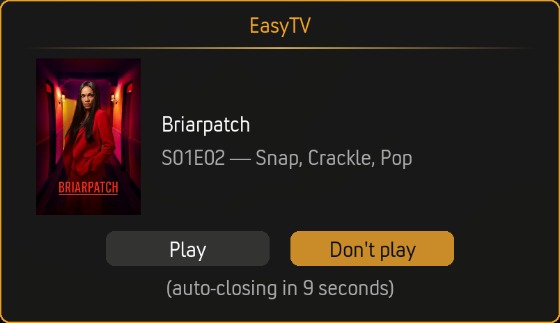
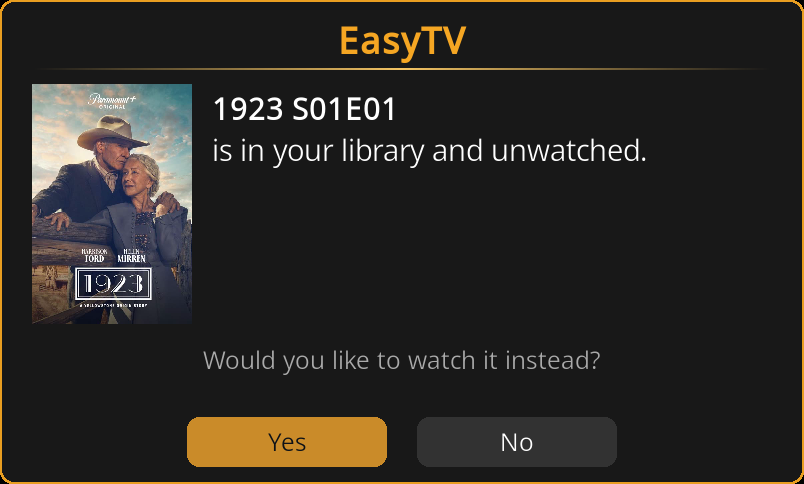

# Settings Reference

Complete reference for all EasyTV settings. Open settings via **Add-ons → EasyTV → Configure** (or highlight EasyTV and press `C`).

> **Note:** Some settings only appear when relevant. For example, movie settings are hidden when "Playlist content" is set to "TV episodes only".

---

## Settings Categories

EasyTV organizes settings into six categories:

| Category | Purpose |
|----------|---------|
| **[EasyTV](#easytv-main)** | Launch behavior |
| **[Shows](#shows)** | Which shows and episodes to include |
| **[Browse Mode](#browse-mode)** | Episode list appearance and behavior |
| **[Random Playlist](#random-playlist)** | Shuffled playlist configuration |
| **[Playback](#playback)** | What happens during/after watching |
| **[Advanced](#advanced)** | Technical settings and tools |

---

## EasyTV (Main)

*The fundamental choice: what happens when you launch EasyTV.*

### On Launch

| Setting | Options | Default | Description |
|---------|---------|---------|-------------|
| **When I open EasyTV** | Show episode list / Play random playlist / Ask me | Ask me | Choose what happens when you launch EasyTV |

**Options explained:**

| Option | Behavior |
|--------|----------|
| **Show episode list** | Opens [Browse Mode](browse-mode.md) immediately |
| **Play random playlist** | Starts playing a [Random Playlist](random-playlist-mode.md) immediately |
| **Ask me** | Shows a dialog: "Show me" (browse) or "Start playlist" (random) |

### Guided Questions

See [Guided Questions](guided-questions.md) for the full guide to what each question asks, what its modes do, and how presets work.

| Setting | Options | Default | Description |
|---------|---------|---------|-------------|
| **Ask what I'm in the mood for on launch** | On / Off | Off | Before Browse or Random Playlist opens, ask a few quick questions (genre, episode length, era, rating, how much to watch) and only offer shows that match. Your answers apply to this launch only and are never saved to settings. |
| **Genres to avoid** | Ask / Pre-set / Skip | Ask | Ask each launch, apply a pre-set list silently, or skip this filter. |
| **Choose genres to avoid...** | (button) | (none) | Pick the genres the pre-set will exclude. |
| **Selected:** | (display only) | - | Genres chosen for the "genres to avoid" pre-set, or "-" when none are chosen. |
| **Genres** | Ask / Pre-set / Skip | Ask | Ask each launch, apply a pre-set list silently, or skip this filter. |
| **Choose genres...** | (button) | (none) | Pick the genres the pre-set will require. |
| **Selected:** | (display only) | - | Genres chosen for the "genres" pre-set, or "-" when none are chosen. |
| **Episode length** | Ask / Pre-set / Skip | Ask | Ask each launch, apply a pre-set length silently, or skip. Skip still uses the Duration Filter from the Shows category when that is enabled. |
| **Pre-set episode length** | No preference / Short (30 min or less) / Medium (30-45 min) / Long (over 45 min) | No preference | Length bucket applied without asking. |
| **Era** | Ask / Pre-set / Skip | Ask | Ask each launch, apply a pre-set recency silently, or skip this filter. |
| **Only shows from the last (years)** | 0-30 (slider) | 0 | 0 disables the pre-set. Applied without asking. |
| **Rating** | Ask / Pre-set / Skip | Ask | Ask each launch, apply a pre-set minimum rating silently, or skip this filter. |
| **Pre-set rating** | Any rating / Good (7+) / Great (8+) | Any rating | Minimum rating applied without asking. |
| **How much to watch** | Ask / Pre-set / Skip | Ask | Ask each launch, apply a pre-set minimum silently, or skip this filter. |
| **Pre-set how much to watch** | Anything / A few episodes available (3+) / Plenty to binge (10+) | Anything | Minimum available episodes applied without asking. |
| **Remember my answers** | On / Off | On | Pre-select your previous answers the next time the questions appear. |
| **Show result counts** | On / Off | On | Show how many shows remain next to each answer. |

**Visibility rules:**
- The mode settings ("Genres to avoid", "Genres", "Episode length", "Era", "Rating", "How much to watch"), "Remember my answers", and "Show result counts" only appear when "Ask what I'm in the mood for on launch" is On.
- Each preset's action button and "Selected:" row (the genre pickers) or preset value setting ("Pre-set episode length", "Only shows from the last (years)", "Pre-set rating", "Pre-set how much to watch") only appears when that question's mode is set to Pre-set.

Each [clone](clones.md) has its own independent copy of this group: its own master switch, its own mode per question, and its own presets. A clone with the master switch on, every question set to Pre-set or Skip, and presets configured is a saved mood that launches straight to a narrowed Browse Mode or Random Playlist with no dialog, separately from the main instance.

### Appearance

| Setting | Options | Default | Description |
|---------|---------|---------|-------------|
| **Theme** | Golden Hour / Ultraviolet / Ember / Nightfall | Golden Hour | Accent color theme for all EasyTV windows and dialogs |
| **Set custom icon** | (button) | (none) | Choose an icon image for EasyTV. Replaces the addon icon in Kodi menus and notifications |
| **Reset to default icon** | (button) | (none) | Restore the original EasyTV icon |

**Themes:**

| Theme | Accent |
|-------|--------|
| **Golden Hour** | Warm orange/golden tones (default) |
| **Ultraviolet** | Purple tones |
| **Ember** | Red tones |
| **Nightfall** | Blue tones |

**Custom icons:** Changes may require a Kodi restart to appear everywhere. Each [clone](clones.md) can have its own icon.

---

## Shows

*Control which TV shows and episodes EasyTV uses. These settings apply to **both** Browse Mode and Random Playlist.*

### Show Filter

| Setting | Options | Default | Description |
|---------|---------|---------|-------------|
| **Use only selected shows** | On / Off | Off | Limit EasyTV to specific shows instead of entire library |
| **Selection method** | Pick shows manually / Use a smart playlist | Pick shows manually | How to choose which shows to include |
| **Select shows...** | (button) | (none) | Opens dialog to manually pick shows |
| **Smart playlist** | Ask each time / Use default | Ask each time | Whether to prompt for playlist or use a saved one |
| **Choose playlist file...** | (button) | (none) | Select a Kodi smart playlist (.xsp) file |

**Visibility rules:**
- "Selection method" only appears when "Use only selected shows" is On
- "Select shows..." only appears when method is "Pick shows manually"
- "Smart playlist" and "Choose playlist file..." only appear when method is "Use a smart playlist"

### Episode Duration

| Setting | Options | Default | Description |
|---------|---------|---------|-------------|
| **Enable duration filter** | On / Off | Off | Filter shows by typical episode length |
| **Minimum episode length** | 0-120 minutes (slider) | 0 | Only include shows with episodes at least this long |
| **Maximum episode length** | 0-120 minutes (slider) | 0 | Only include shows with episodes no longer than this |

**How duration is calculated:**
- EasyTV samples episodes from each show
- Calculates the median duration (robust to outliers like double-length finales)
- Uses stream metadata from video files
- Shows without duration data are excluded when filter is active

**Setting values:**
- **0** = No limit (disabled)
- Both at 0 = Filter disabled (all shows included)

> ⚠️ If minimum > maximum, EasyTV shows a warning and disables the filter.

### Random Episode Order

| Setting | Options | Default | Description |
|---------|---------|---------|-------------|
| **Select shows for random order...** | (button) | (none) | Choose shows that don't require sequential viewing |

Opens a selection dialog. Shows marked here will:
- Pick any random unwatched episode instead of the "next" one
- Work differently in "Both" episode selection mode

See [Random-Order Shows](random-order-shows.md) for full details.

### Episode Options

| Setting | Options | Default | Description |
|---------|---------|---------|-------------|
| **Series premieres** | Skip / Mix in / Only | Mix in | Controls whether S01E01 episodes from unstarted shows appear |
| **Season premieres** | Skip / Mix in / Only | Mix in | Controls whether SxxE01 episodes (first episode of each season) appear |
| **Include positioned specials in watch order** | On / Off | Off | Insert TVDB-positioned specials at their designated place in the episode sequence |

**Series premieres** controls S01E01 from shows you haven't started:
- **Skip:** Only shows you've already begun watching appear.
- **Mix in:** Series premieres appear alongside regular episodes (default).
- **Only:** Restricts the list to premiere episodes only. Useful for discovering new shows to start.

**Season premieres** controls SxxE01 episodes (new seasons):
- **Skip:** Shows only appear when you're mid-season. Useful if you prefer to continue from where you left off.
- **Mix in:** Season premieres appear alongside regular episodes (default).
- **Only:** Restricts the list to premiere episodes only.

**Premieres you have already started are an exception to Skip.** If you began
watching a premiere and stopped part-way, **Skip** still shows it, so you have a
route back to finishing it. A premiere you have not started is skipped as normal.

This exception does not apply in **Only** mode. There the premiere type is the
whole point of the list, so a part-watched series premiere never appears in a
season-premieres-only list, and vice versa.

When either setting is **Only**, the entire list becomes premieres-only. The other setting then controls which premiere types appear:

| Series premieres | Season premieres | Result |
|-----------------|-----------------|--------|
| Mix in | Mix in | All episodes (default) |
| Skip | Mix in | No S01E01, only shows already started |
| Mix in | Skip | No season premieres, only mid-season shows |
| Skip | Skip | Only mid-season episodes |
| Only | Mix in | Premieres only: both S01E01 and season premieres |
| Only | Skip | Premieres only: S01E01 only (no season premieres) |
| Mix in | Only | Premieres only: both S01E01 and season premieres |
| Skip | Only | Premieres only: season premieres only (no S01E01) |
| Only | Only | Premieres only: both types |

**Positioned specials:** Some shows have specials that TVDB marks as belonging between specific episodes (e.g., a special that should be watched between S10E55 and S10E56). When enabled, these specials appear at their designated position in the watch order. Specials without TVDB positioning data remain excluded.

> **Multi-instance sync users:** Configure this setting identically on all devices. Different values will cause devices to disagree on the next episode. See [Multi-Instance Sync](multi-instance-sync.md#consistent-settings).

---

## Browse Mode

*Settings for "Show episode list" mode. These apply when browsing your next episodes.*

### Appearance

| Setting | Options | Default | Description |
|---------|---------|---------|-------------|
| **View style** | Card List / Posters / Big Screen / Split View / Showcase | Card List | Visual layout for the episode list |
| **Return to EasyTV after playback** | On / Off | On | Come back to episode list after watching |
| **Hide random-order shows** | On / Off | Off | Don't show random-order shows in the list |

**View styles:**

| Style | Description |
|-------|-------------|
| **Card List** | Data-dense rows with poster, show/episode info, and stats |
| **Posters** | Visual grid with show artwork and episode details |
| **Big Screen** | Large artwork optimized for 10-foot viewing |
| **Split View** | Two-column layout: show list on the left, detail panel on the right |
| **Showcase** | Horizontal poster filmstrip with a fixed focus position; the focused poster zooms in with an info panel below |

### Sorting

| Setting | Options | Default | Description |
|---------|---------|---------|-------------|
| **Sort by** | Show Name / Last Watched / # Unwatched Episodes / # Watched Episodes / Season / Random / Avg Episode Duration | Last Watched | How to order shows in the list |
| **Reverse sort order** | On / Off | Off | Flip the sort direction |

**Sort methods:**

| Method | Default Order | Reversed |
|--------|---------------|----------|
| **Show Name** | A → Z | Z → A |
| **Last Watched** | Most recent first | Oldest first |
| **# Unwatched** | Most unwatched first | Fewest first |
| **# Watched** | Most watched first | Fewest first |
| **Season** | Highest season first | Lowest first |
| **Random** | Shuffled | (no meaningful reverse) |
| **Avg Episode Duration** | Longest typical episode first | Shortest first |

### Performance

| Setting | Options | Default | Description |
|---------|---------|---------|-------------|
| **Limit shows displayed** | On / Off | Off | Cap the number of shows in the list |
| **Maximum shows** | 1-30 (slider) | 10 | How many shows when limited |

Enable these on low-power devices (Raspberry Pi, older Fire TV) for better responsiveness.

---

## Random Playlist

*Settings for "Play random playlist" mode. These apply when creating shuffled playlists.*

### Basics

| Setting | Options | Default | Description |
|---------|---------|---------|-------------|
| **Playlist content** | TV episodes only / TV and movies / Movies only | TV episodes only | What to include in the playlist |
| **Playlist length** | 1-50 (slider) | 5 | Number of items in the playlist |
| **Allow multiple episodes of same TV Show** | On / Off | Off | Let the same show appear multiple times |
| **How to repeat shows** | Spread out / Truly random | Spread out | When a show is allowed to come round again |

**Visibility:** "Allow multiple episodes" is hidden when content is "Movies only". "How to repeat shows" appears only when "Allow multiple episodes" is On.

### How to repeat shows

Only relevant once **Allow multiple episodes of same TV Show** is enabled.

| Option | What you get |
|--------|--------------|
| **Spread out** (default) | Every other eligible show gets a turn before any show comes round again. A 10-episode playlist drawn from 15 shows therefore contains 10 different shows; repeats appear only once the pool is smaller than the playlist, so 7 shows for 10 episodes gives 3 repeats. |
| **Truly random** | Every episode is drawn from all eligible shows, so a show can come back at any time, including twice in a row. With 15 shows you will usually still see mostly different ones, but repeats are down to chance rather than held back until needed. |

Both options fill the playlist to the requested length whenever there is enough
content. The difference is only *when* a show is allowed to repeat.

### Content Options

Settings that depend on your **Playlist content** selection:

#### TV Episode Settings

*Visible when TV episodes are included*

| Setting | Options | Default | Description |
|---------|---------|---------|-------------|
| **Episode selection** | Unwatched only / Watched only / Both | Unwatched only | Which episodes to include |
| **Unwatched episode chance** | 0-100% (slider) | 50% | In "Both" mode, how often to pick unwatched |
| **Start playlist with unfinished episodes** | On / Off | On | Prioritize partially watched episodes |
| **Seek to resume point for episodes** | On / Off | On | Auto-skip to where you left off in partial episodes (seeks 10 seconds before your last position) |

#### Movie Settings

*Visible when movies are included*

| Setting | Options | Default | Description |
|---------|---------|---------|-------------|
| **Movie selection** | Unwatched only / Watched only / Both | Unwatched only | Which movies to include |
| **Start playlist with unfinished movies** | On / Off | On | Prioritize partially watched movies |
| **Seek to resume point for movies** | On / Off | On | Auto-skip to where you left off in partial movies (seeks 10 seconds before your last position) |
| **Start watched movies at random point** | On / Off | Off | Start 5-75% through watched movies |
| **Filter movies by playlist...** | (button) | All movies | Limit movies using a smart playlist |

#### Mixed Content Settings

*Visible when "TV and movies" is selected*

| Setting | Options | Default | Description |
|---------|---------|---------|-------------|
| **Movie chance** | 0-100% (slider, step 5) | 25% | How much of the playlist should be movies |

**Movie chance values:**
- **0%** = No movies (TV only)
- **25%** = About a quarter movies (default)
- **50%** = Equal mix of movies and TV
- **100%** = All movies

### Notifications

| Setting | Options | Default | Description |
|---------|---------|---------|-------------|
| **Show info when playing** | On / Off | On | Display notification when each item starts |

### Playlist Continuation

| Setting | Options | Default | Description |
|---------|---------|---------|-------------|
| **Prompt to continue playlist** | On / Off | Off | Ask to generate another playlist when finished |
| **Countdown duration (seconds)** | 0-60 (slider) | 20 | Seconds before the prompt auto-acts |
| **If countdown expires** | Stop / Generate new playlist | Stop | Which button fires when the countdown reaches zero with no input |

**Countdown values:**
- **0** = Wait indefinitely (no auto-dismiss)
- **1-60** = Auto-act after this many seconds

The dialog itself always offers both **Generate** and **Stop** buttons. The **If countdown expires** setting only controls which one fires on timeout.

---

## Playback

*These settings work for **all TV shows in Kodi**, not just EasyTV playback.*

### Next Episode Prompt

| Setting | Options | Default | Description |
|---------|---------|---------|-------------|
| **Ask to watch next episode** | On / Off | Off | Show prompt after an episode ends |
| **Prompt timeout (seconds)** | 0-60 (slider) | 5 | How long the prompt stays on screen |
| **If prompt times out** | Don't play / Play next episode | Don't play | Default action when timeout expires |
| **Also prompt during random playlists** | On / Off | Off | Show prompt even during EasyTV playlists |

**Timeout values:**
- **0** = Wait indefinitely (no auto-dismiss)
- **1-60** = Auto-act after this many seconds

### Warnings

| Setting | Options | Default | Description |
|---------|---------|---------|-------------|
| **Warn about earlier unwatched episodes** | On / Off | On | Alert if skipping an unwatched episode |

When enabled, if you're about to play S02E05 but S02E03 is unwatched, EasyTV asks if you want to watch the earlier episode instead. The dialog shows the show + episode number and asks whether to switch to the library version:

Click **Yes** to stop the current playback and play the earlier library episode instead. Click **No** to continue with what you started.

---

## Advanced

*Technical settings and utilities.*

### Background Service

| Setting | Options | Default | Description |
|---------|---------|---------|-------------|
| **Show notification when ready** | On / Off | On | Notify when library scan completes on startup |
| **Export Episode smart playlists** | On / Off | Off | Create Episode-type playlists for channel surfing |
| **Export TVShow smart playlists** | On / Off | Off | Create TVShow-type playlists for skin widgets |
| **Apply show filter to smart playlists** | On / Off | Off | Only include shows matching your show filter |

**Episode playlists** point to specific episode files and are ordered randomly. They are ideal for channel surfing or PseudoTV Live.

**TVShow playlists** point to shows (not episodes) and are ordered alphabetically. They are ideal for skin widgets that browse by show artwork.

**Apply show filter:** When enabled, the auto-created playlists respect your TV show filter (Settings → Shows). This only works on the main addon, not clones.

When enabled, EasyTV maintains ten `.xsp` files (five Episode, five TVShow):
- All Shows
- Continue Watching
- Start Fresh
- Show Premieres (S01E01, brand new shows)
- Season Premieres (S02E01+, new seasons)

See [Advanced Features](auto-generated-playlists.md) for details.

### Multi-Instance Sync

| Setting | Options | Default | Description |
|---------|---------|---------|-------------|
| **Enable multi-instance sync** | On / Off | Off | Share watch progress across multiple Kodi devices via shared MySQL/MariaDB |
| **Clear sync data...** | (button) | (none) | Delete all shared sync data and reset revision counter |

**Visibility:** "Clear sync data..." only appears when "Enable multi-instance sync" is On.

**Requirements:** A shared MySQL/MariaDB video database (configured in `advancedsettings.xml`) and the `script.module.pymysql` addon.

See [Multi-Instance Sync](multi-instance-sync.md) for full setup and usage documentation.

### Debugging

| Setting | Options | Default | Description |
|---------|---------|---------|-------------|
| **Enable debug logging** | On / Off | Off | Write detailed diagnostics to a separate log file |

Log location: `special://profile/addon_data/script.easytv/logs/easytv.log`

See [Troubleshooting](troubleshooting-and-faq.md#debug-logging) for log file paths.

### Tools

| Setting | Options | Default | Description |
|---------|---------|---------|-------------|
| **Create EasyTV copy...** | (button) | (none) | Create a clone with separate settings |
| **Export episodes to folder...** | (button) | (none) | Copy next episodes for offline viewing |

See [Clones](clones.md) and [Episode Export](episode-export.md) for details on these tools.

---

## Settings Dependencies Summary

Some settings only appear based on other settings:

| Setting | Appears When |
|---------|--------------|
| Selection method options | "Use only selected shows" is On |
| Episode selection, TV partial settings | Playlist content includes TV |
| Movie selection, movie partial settings | Playlist content includes movies |
| Movie chance | Playlist content is "TV and movies" |
| Unwatched episode chance | Episode selection is "Both" |
| Start watched movies at random point | Movie selection includes watched |
| Allow multiple episodes | Playlist content is not "Movies only" |
| How to repeat shows | "Allow multiple episodes" is On |
| Countdown duration | "Prompt to continue playlist" is On |
| Prompt timeout, default action | "Ask to watch next episode" is On |
| Maximum shows | "Limit shows displayed" is On |
| Duration min/max | "Enable duration filter" is On |
| Apply show filter to smart playlists | Episode or TVShow playlists enabled |
| Clear sync data... | "Enable multi-instance sync" is On |

---

## Related Pages

- **[Browse Mode](browse-mode.md):** How browse settings work in practice
- **[Random Playlist Mode](random-playlist-mode.md):** How playlist settings work in practice
- **[Smart Playlist Integration](smart-playlist-integration.md):** Using smart playlists for filtering
- **[Clones](clones.md):** Multiple EasyTV instances with independent settings
- **[Episode Export](episode-export.md):** Copy your "next episode" files to another location
- **[Auto-Generated Playlists](auto-generated-playlists.md):** Smart playlists for skin widgets and channel surfing
- **[Troubleshooting](troubleshooting-and-faq.md):** Debug logging explained
